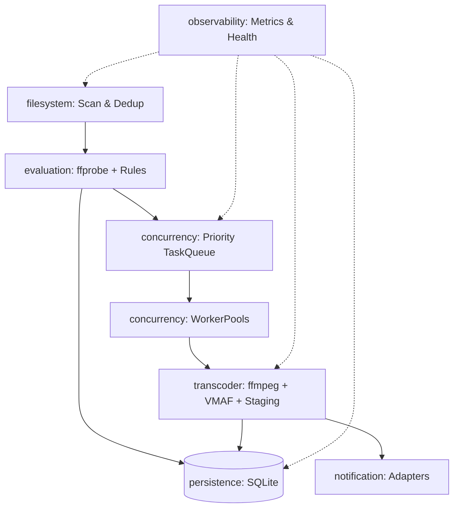

# AI_CONTEXT.md — Architectural & Operational Knowledge Base

> **Target Audience:** Future AI coding assistants & developers.  
> **Purpose:** Provide an immediate, high-density technical summary of MediaCruncher to avoid re-reading the entire codebase and docs.

---

## 1. Executive Summary & Purpose

**MediaCruncher** is a headless, autonomous media processing daemon written in pure Go (Go 1.25.5, Zero-CGO).  
Its job is to:
1. Scan local or network filesystem directories (`filesystem`).
2. Analyze media files via `ffprobe` and match them against rule sets (`evaluation`).
3. Queue tasks by priority, manage batching, rate-limiting, and retries (`concurrency`).
4. Execute hardware- or software-accelerated video/audio transcoding with VMAF metric verification and corruption checks (`transcoder`).
5. Persist processing state, queue entries, and historical decisions in SQLite (`persistence`).
6. Dispatch events and status alerts to external webhooks and notification channels (`notification`).
7. Expose Prometheus metrics, structured logs, and health status (`observability`).

---

## 2. Tech Stack & Environment Constraints

- **Language:** Go 1.25.5 (pure Go, zero-CGO).
- **SQLite Engine:** `modernc.org/sqlite` (pure Go port; no CGO compiler needed).
- **External CLI Dependencies:** `ffmpeg`, `ffprobe`, and `vmaf` binaries must be in `$PATH`.
- **Operating Systems:** Linux (amd64, arm64), macOS (amd64, arm64), Windows (amd64).

---

## 3. Core Architecture & Module Flow

### Module Responsibilities

1. **`cmd/main.go`**:
   - Single application entrypoint.
   - Discovers config via `$MC_CONFIG_DIR`, executable directory, or CWD.
   - Initializes logger and Prometheus metrics server (`/metrics`).
   - *(Note: orchestrator loop initialization into main daemon runtime is currently a work in progress).*

2. **`internal/config`**:
   - Master configuration loaded from `mediacruncher.json` or `MC_*` environment variables.
   - `DefaultConfig()` is the single source of truth for fallback values.
   - Parses human-readable durations and hardware acceleration settings.

3. **`internal/filesystem`**:
   - Traverses directories with `filepath.WalkDir`.
   - Validates allowed path scopes (path traversal protection).
   - Deduplication through fast partial file hashing (head/mid/tail chunks) and size indexing.

4. **`internal/evaluation`**:
   - Runs `ffprobe` externally to obtain JSON metadata (codecs, bitrates, resolutions, streams).
   - Evaluates media against configured user rules (e.g. `codec == "h264" && bitrate > 8000k`).
   - Determines actions: `transcode`, `copy`, `ignore`, `quarantine`.

5. **`internal/concurrency`**:
   - Thread-safe priority task queue (`TaskQueue`) with channels and mutexes.
   - Multi-type worker pools (`analysis`, `transcode`, `verification`).
   - Exponential backoff retry manager (`RetryManager`) and batch splitter (`BatchSplitter`).

6. **`internal/transcoder`**:
   - Orchestrates `ffmpeg` CLI executions.
   - Staging workflow: transcode to temp file (`.tmp`) -> compute VMAF score vs original -> verify integrity -> atomic rename over destination.
   - Automatic fallback: Hardware acceleration (NVENC, QSV, VAAPI, VideoToolbox) -> Software (libx264/libx265/libsvtav1) upon failure.

7. **`internal/persistence`**:
   - Pure Go SQLite database (`modernc.org/sqlite`).
   - Single-writer architecture: `MaxOpenConns = 1`, WAL journal mode, immediate transaction locking.
   - `RecoverProcessing()` resets orphaned `processing` items to `pending` after crash/unclean shutdown.

8. **`internal/notification`**:
   - Multi-channel notification pipeline with dead-letter queue (`DLQ`).
   - Supported adapters under `adapters/`: Discord, Slack, Telegram, Gotify, SMTP (STARTTLS / SMTPS).

9. **`internal/observability`**:
   - Structured JSON/Console logger (`NewStdLogger`).
   - Prometheus metrics registry (`NewRegistry`).
   - Health checker (`NewHealthChecker`).
   - Version injection via ldflags: `BuildVersion`, `BuildCommit`, `BuildTime`.

---

## 4. Key Conventions & Rules

- **Zero-CGO:** Never introduce CGO-dependent libraries. Must compile with `CGO_ENABLED=0`.
- **Constructors:** All internal modules follow `New(cfg Config) *Engine`.
- **No Global Mutable State:** Observability build vars (`version.go`) are the only exported package-level variables.
- **Error Wrapping:** Always wrap errors with contextual detail (`fmt.Errorf("context: %w", err)`).

---

## 5. CI/CD & Build Gotchas

- **Multi-OS Shells:** CI scripts using PowerShell syntax (`$buildDir`, `Test-Path`, etc.) **must** declare `shell: pwsh` on GitHub Actions; otherwise, Linux and macOS runners default to `/bin/bash` and fail with exit code 127 (`=: command not found`).
- **GitLab CI:** Standard pipeline defined in `.gitlab-ci.yml` (validate -> build -> test -> verify -> docker-build -> sign -> release).
- **GitHub CI:** Workflows located in `.github/workflows/` (`ci.yml`, `release.yml`, and `docker.yml`). Multi-arch container images (`linux/amd64`, `linux/arm64`) are built and published to GitHub Container Registry (`ghcr.io/pe46dro/mediacruncher`) on tags and `main` branch pushes.
