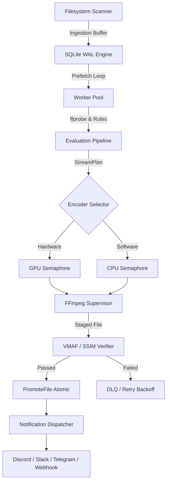

# MediaCruncher

**Automated, Distributed, Zero-CGO Media Transcoding Engine**

MediaCruncher is a production-grade, pure Go distributed media transcoding engine designed for autonomous high-throughput encoding, intelligent rule-based evaluation, and strict quality verification.

---

## Key Features

- **Pure Go & Zero-CGO**: 100% pure Go implementation utilizing modern SQLite driver (`modernc.org/sqlite`), enabling seamless cross-compilation (`CGO_ENABLED=0`) across Linux, macOS, and Windows.
- **Operating System Process Isolation**: FFmpeg/FFprobe sub-processes run inside dedicated OS containment trees—Windows Job Objects (`JOB_OBJECT_LIMIT_KILL_ON_JOB_CLOSE`) and POSIX Process Groups (`setpgid`), ensuring zero orphaned processes on crash or cancellation.
- **Single-Writer Actor SQLite Persistence**: SQLite with WAL mode, serialized write channel actor, and concurrent connection pool for non-blocking telemetry and reads.
- **Hardware Acceleration Negotiation**: Dynamic autodetection for NVIDIA NVENC, Intel QuickSync (QSV), AMD AMF, and Linux VAAPI with automatic fallback to optimized software encoders (`libsvtav1`, `libx265`, `libx264`).
- **GPU & CPU Worker Semaphores**: Independent semaphore limits prevent NVENC session exhaustion while maintaining maximal CPU throughput.
- **Automated VMAF & SSIM Verification**: High-throughput stratified segment sampling across 15%, 50%, and 85% percentiles ensures transcoded outputs strictly adhere to visual quality thresholds.
- **Multi-Stream Preservation**: Guaranteed preservation of surround audio (5.1/7.1 Atmos/DTS), multi-language commentary tracks, and subtitle streams.
- **Cross-Device Atomic Promotion**: Safe cross-filesystem promotion with cryptographic SHA-256 verification and atomic rename.
- **Multi-Channel Notification Dispatcher**: Native delivery to Discord, Telegram, Slack, Gotify, Webhooks (with HMAC-SHA256 signatures), and SMTP with sliding-window batching and Dead-Letter Queue (DLQ).
- **Observability**: Structured logging via `log/slog` and Prometheus metrics exporter with `/healthz` and `/metrics` endpoints.

---

## Quickstart

### Prerequisites
- Go 1.22+
- FFmpeg 6.0+ and FFprobe in system `PATH`

### Local Installation
```bash
# Clone and build
git clone https://github.com/your-org/mediacruncher.git
cd mediacruncher

# Build binary
go build -o bin/mediacruncher ./cmd/mediacruncher
```

### Docker & Docker Compose Deployment
MediaCruncher provides a multi-stage Docker build and a ready-to-run `docker-compose.yml` with pre-configured volume mounts:

```bash
# Start MediaCruncher daemon in background
docker compose up -d

# View real-time logs
docker compose logs -f

# Check health and status
docker compose ps
```

#### Mounted Volumes
| Host Path | Container Path | Purpose |
|---|---|---|
| `./config/config.docker.yaml` | `/etc/mediacruncher/config.yaml:ro` | Read-only configuration |
| `./data` | `/var/lib/mediacruncher:rw` | SQLite database & audit state |
| `./staging` | `/tmp/mediacruncher/staging:rw` | Fast staging area for active encodes |
| `./media` | `/media:rw` | Media library to scan and transcode |

---

## CLI Usage

```
MediaCruncher - Automated Distributed Media Transcoder (v1.0.0)

Usage:
  mediacruncher <command> [arguments]

Commands:
  daemon      Start continuous transcoding worker daemon with API & scheduler
  scan        Run one-shot filesystem scan to discover and queue media files
  eval        Probe and evaluate media file against decision rules and stream plans
  transcode   Run one-shot transcode on a file with verification and promotion
  status      Display current queue depths, audit records, and worker metrics
  version     Display application version and hardware acceleration capabilities
```

### 1. Probe & Evaluate a File
Inspect container streams, evaluate decision rules, and view the synthesized FFmpeg stream map:
```bash
mediacruncher eval /path/to/movie.mkv
```

### 2. Transcode a Single File
Run an isolated transcode with VMAF verification and progress tracking:
```bash
# In-place atomic replacement with balanced HEVC
mediacruncher transcode /path/to/movie.mkv -preset balanced-hevc

# Output to distinct destination with AV1
mediacruncher transcode /path/to/movie.mkv -dest /output/movie.mp4 -preset efficient-av1
```

### 3. Filesystem Discovery Scan
Walk configured scopes, apply exclusion/depth rules, and enqueue discovered media:
```bash
mediacruncher scan -config config.example.yaml
```

### 4. Run Continuous Daemon
Start the autonomous worker pool, background prefetcher, metrics server, and graceful shutdown coordinator:
```bash
mediacruncher daemon -config config.example.yaml
```

### 5. Check System Status
View current database queue depth and recent audit records:
```bash
mediacruncher status
```

---

## Architecture Overview



---

## Verification & Testing

Execute comprehensive unit and integration tests across all modules:
```bash
go test -v ./...
```

Run tests with race detection:
```bash
go test -v -race ./...
```

---

## License
MIT License
